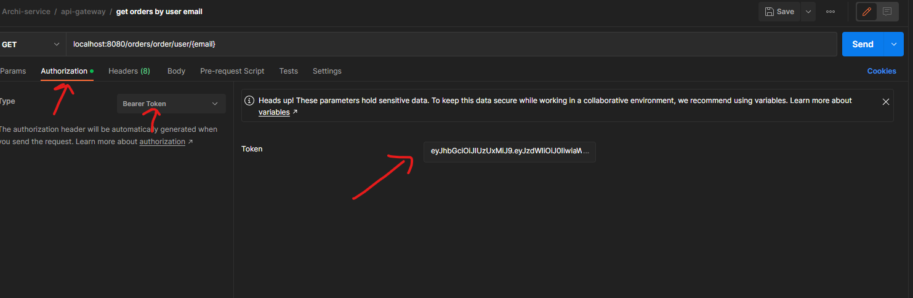
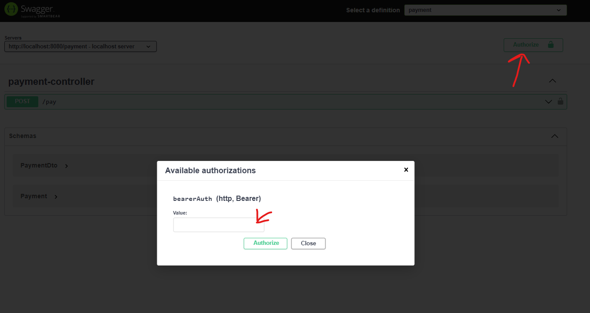

# Projet d'Architecture Orientée Services

## Équipe de travail

&ensp;Pour la mise en œuvre de cette application, nous sommes trois étudiant(e)s, Amandine CARLIER (n°21700078), William DENORME (n°21903046) et François DEROUBAIX (n°22105578). De cette façon, nous avons pu répartir la charge de travail de l’ensemble du projet.

## Architecture mise en place

### Illustration

### Explications

L'ensemble de tous ces services sont exécutables via un docker-compose avec la commande : 

`docker compose up -d (--build)`

/!\ Il est possible qu'au démarage du docker-compose il faille relancer manuellement les containers qui ce sont arrêtés, 
en effet les autres micro-services ont besoin de spring config et nous n'avons pas trouvé comment ajouter un *delay* de lancement à ces containers.

Une fois l'ensemble des services démarrés, vous pouvez accéder à la *gateway* via l'url : 
`localhost:8080`

Vous avez également accès à un certain nombre de service : 

#### Swagger
`http://localhost:8080/webjars/swagger-ui/index.html`

#### Postman
`./docs/Archi-service.postman_collection.json`

#### Zipkin
`http://localhost:9411`

Malheureusement *Zipkin* ne reçoit aucune requête dû au problème de compatibilité avec spring boot 3, nous n'avons pas réussi à comprendre les changements de fonctionnement entre la version 2.7 et la 3.0.

#### Le client front-end
`http://localhost:3000`

#### Eureka
`http://localhost:8761`

## Sécurité

Attention, notre projet comporte des routes sécurisées, que ce soit sur postman ou swagger, il est important de :
- se créer un compte via la route : `/client/auth/register` 
- se login via la route : `/client/auth/login`
- récupérer le token en sortie

Seules les routes suivantes sont accessibles **sans token** : 
* Pour swagger : 
  * /client/v3/api-docs,
  * /products/v3/api-docs,
  * /orders/v3/api-docs,
  * /payment/v3/api-docs,
  * /webjars/swagger-ui
* Pour les micro-services :
  * /client/auth/login,
  * /client/auth/register,
  * /client/auth/valide-token,
  * /products/product,

*Remarque : La collection postman nous permet de faire ces appels, ainsi que biens d'autres (concerant les produits, les commandes, etc.).*

### Cas postman

### Cas swagger

## Routes mises en place

### Pour la gestion et la vente des produits *(ms-products)* :
  * GET : getAll
  * GET : getProductById(id)
  * POST : create(productDto)
  * DELETE : delete(id)
  * PUT : update(id, productDto)

*Remarque : La collection postman permet d'ajouter un nouveau produit afin de tester notre projet.*

### Pour la gestion des clients *(ms-client)* :
  * POST : addNewUser(userDto)
  * PUT : getToken(userCredentials)
  * GET : validateToken(token)
  * GET : authorization(email)

### Pour la gestion des commandes / du panier *(ms-orders)* :
  * GET : getAll
  * GET : getById(id)
  * GET : getByUserId(email)
  * POST : create(orderDto)

### Pour la gestion des paiements *(ms-payment)* :
  * POST : pay(paymentDto)

*Remarque : Pour valider la commande, il faut 6 chiffres pour le second champ, 2 pour le troisième et une date sous la forme dd/mm pour le quatrième.*
